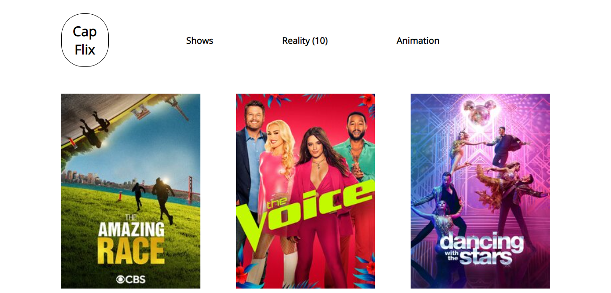
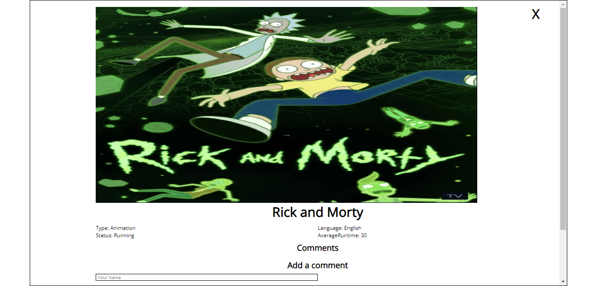
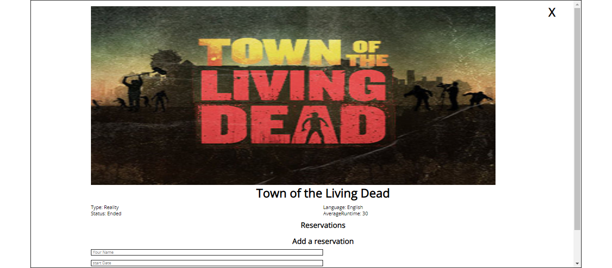

<!--
HOW TO USE:
This is an example of how you may give instructions on setting up your project locally.

Modify this file to match your project and remove sections that don't apply.

REQUIRED SECTIONS:
- Table of Contents
- About the Project
  - Built With
  - Live Demo
- Getting Started
- Authors
- Future Features
- Contributing
- Show your support
- Acknowledgements
- License

After you're finished please remove all the comments and instructions!
-->

  <h3><b>Capstone javascript project</b></h3>

<!-- TABLE OF CONTENTS -->

# 📗 Table of Contents

- [📖 About the Project](#about-project)
  - [:camera: project screenshot](#screen-shoot)
  - [🛠 Built With](#built-with)
    - [Tech Stack](#tech-stack)
    - [Key Features](#key-features)
  - [🚀 Live Demo](#live-demo)
- [💻 Getting Started](#getting-started)
  - [Setup](#setup)
  - [Prerequisites](#prerequisites)
  - [Install](#install)
  - [Usage](#usage)
- [👥 Authors](#authors)
- [🔭 Future Features](#future-features)
- [🤝 Contributing](#contributing)
- [⭐️ Show your support](#support)
- [🙏 Acknowledgements](#acknowledgements)
- [📝 License](#license)

<!-- PROJECT DESCRIPTION -->

# 📖 Capstone javascript project 

> This project is a group capstone project that uses the API and best practices of HTML5, CSS3, and JavaScript in addition to test functions. It is a part of the Microverse in the JavaScript and networking module.

  
   

  <h3><b>MHome page</b></h3>

  
   

  <h3><b>Comment Popup</b></h3>

  
   

  <h3><b>Reservation Popup</b></h3>

## 🛠 Built With 

> HTML 5 , css3, javascript ES6, NPM ,babel, webpack and jest.

### Tech Stack 

> HTML 5 , css3, javascript ES6, NPM ,babel, webpack and jest.

<!-- Features -->

### Key Features 

- **[Tells you about about the CapFlix application.]**
- **[Fetch data from TVMAZE and Involvement API.]**
- **[To display all movie cards.]**
- **[To display all likes, comment and reservation attached to a movie.]**
- **[Webpack and ES6 modules.]**
- **[ Get the total length of movies, likes, comments and reservation]**

(<a href="#readme-top">back to top</a>)
<!-- LIVE DEMO -->

## 🚀 Live Demo 

- [Live Demo Link](https://emekaemmanuel.github.io/capstone2) 

(<a href="#readme-top">back to top</a>)

## Project Presentation 

- [Project Presentation video link](https://) 

<!-- GETTING STARTED -->

## 💻 Getting Started 

to run on your localhost clone the project to local folder

> cd capstone2
> npm i
> npm run server
> open your brower locate to localhost:3000

### Setup

> 
 git clone https://github.com/EmekaEmmanuel/capstone2.git

> cd capstone2

(<a href="#readme-top">back to top</a>)

### Prerequisites

In order to run this project you only need:

- latest web-browser
- node.js and npm

### Install

To install this project in your local machine use

> npm i
> npm run build

### Usage

To run the project, execute the following command:

> In visual studio code Go to dist folder then open index.html in live server.

<!-- AUTHORS -->

## 👥 Authors 

👤 **zewdu erkyhun**

- GitHub: [@zewdu444](https://github.com/zewdu444)
- Twitter: [@zewdu444](https://twitter.com/zewdu444)
- LinkedIn: [zewdu-erkyhun](https://www.linkedin.com/in/zewdu-erkyhun-081378b3/)

👤 **Emeka Emmanuel Ugboaja**

- GitHub: [EmekaEmmanuel](https://github.com/EmekaEmmanuel)
- Twitter: [@emekaekeoha](https://twitter.com/emekaekeoha)
- LinkedIn: [emeka-ugboaja](https://www.linkedin.com/in/emeka-ugboaja-167820226)

👤 **Jugoslav Achkoski**

- GitHub: [@jugosack](https://github.com/jugosack)
- Twitter: [@Jugosla22401325](https://twitter.com/Jugosla22401325)
- LinkedIn: [jugoslav-achkoski](https://www.linkedin.com/in/jugoslav-achkoski-3a074021/)

<!-- FUTURE FEATURES -->

## 🔭 Future Features 

>

## 🤝 Contributing 

Contributions, issues, and feature requests are welcome!

Feel free to check the [issues page](https://github.com/EmekaEmmanuel/capstone2/issues).

(<a href="#readme-top">back to top</a>)

<!-- SUPPORT -->

## ⭐️ Show your support 

> If you like the project please give it star

(<a href="#readme-top">back to top</a>)

<!-- ACKNOWLEDGEMENTS -->

## 🙏 Acknowledgments 

> we would like to thank Microverse team

(<a href="#readme-top">back to top</a>)

<!-- LICENSE -->

## 📝 License 

This project is [MIT](./LICENSE) licensed.

(<a href="#readme-top">back to top</a>)

(../../issues/https://github.com/EmekaEmmanuel/capstone2/issues).